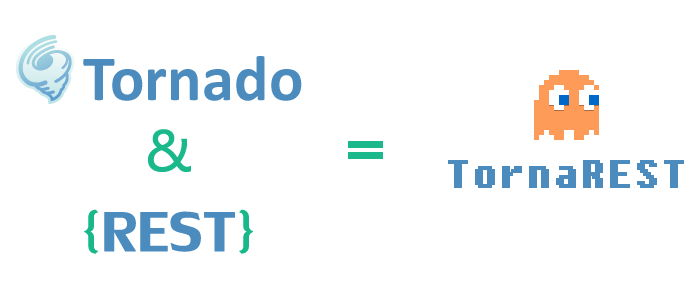

# tornaREST


## Description
TornaREST is a simple RESTful Web Service build with **[Tornado](http://www.tornadoweb.org/en/stable/)** Web Server.It's a demo and a base framework for learning how to build a web service provides RESTful API.

### Some Detail
**[How to use Python to build a RESTful Web Service](http://zhuanlan.zhihu.com/kotandroid/20488077)**

### Run server
- Edit `config.py` in the project root path:
- Run `init_db.py` at first time to create nesscery data in mongodb
- Run `server.py`

### API response format  
```
{
    'code': code,
    'msg': msg,
    'data': data
}
```

## Features
- Using RESTful API
- Using tornado
- Using mongodb
- Using redis

